# LearnOn-App

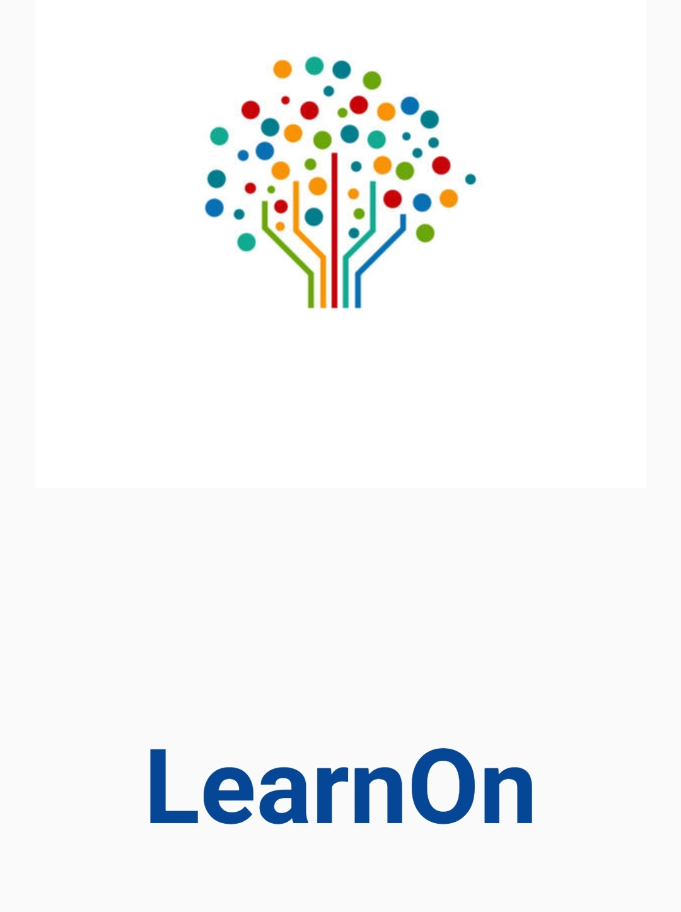

## An app for Learning purposes.

Learning system is now a days change due to COVID-19 and Modren Technologies. The proposed project will facilitate the access to Learning information of all students enrolled across different subjects and assignments. The task will be less time consuming now. Another purpose for developing this application is to generate the report automatically at the end of the session or in between the session.

LearOn App is an android application to automate various tasks associated with handling students’ Details and better organizing the stored information and optimum performance, thus helping the colleges/Institute to ensure smooth working of these processes. It is relatively fast approach to enter subject ,assgnments notice, highly reliable and efficient. The scope of the project is the android mobile devices on which this application would be installed and it will work for a particular school or college or institution. Later on, the application can be modified for sharing documents purposes, assignments.The learning day Modern time-consuming learning, aassignments purpose.

Admin can Upload assignments by each class and subject. He is remove and add Student, Tearcher, Parents. Add Timetable and bus information.

## Here are some insights of my project.

### Login and Registration Page.

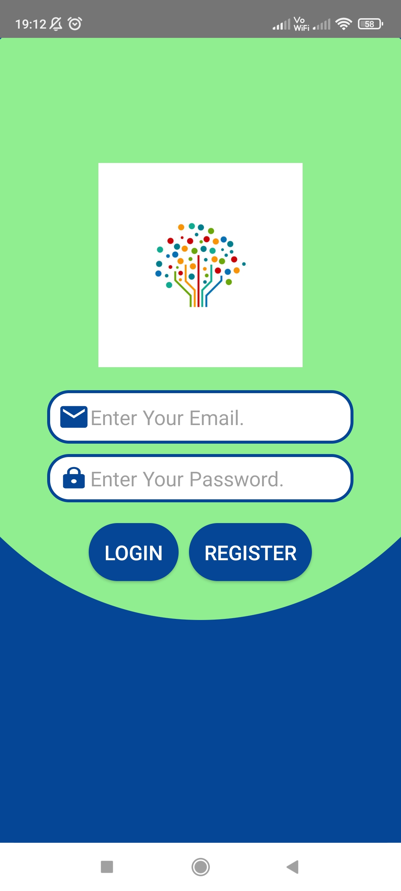  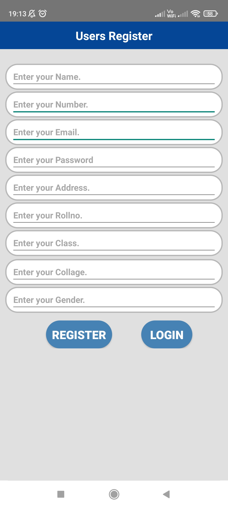

### Admin Pages
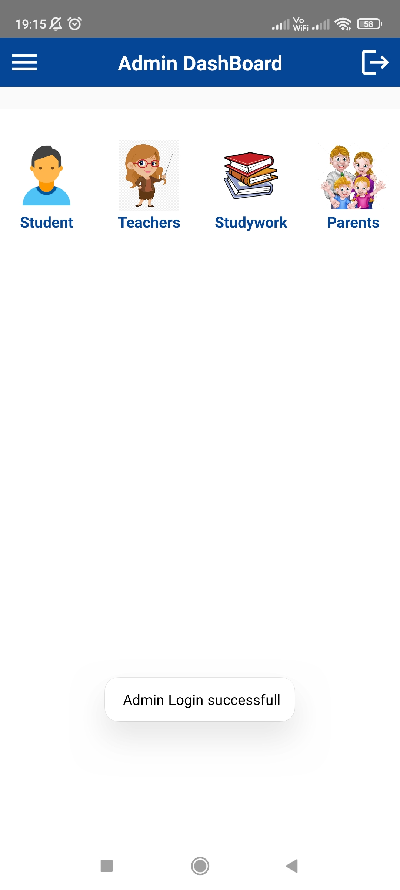  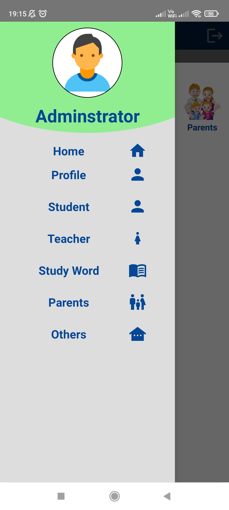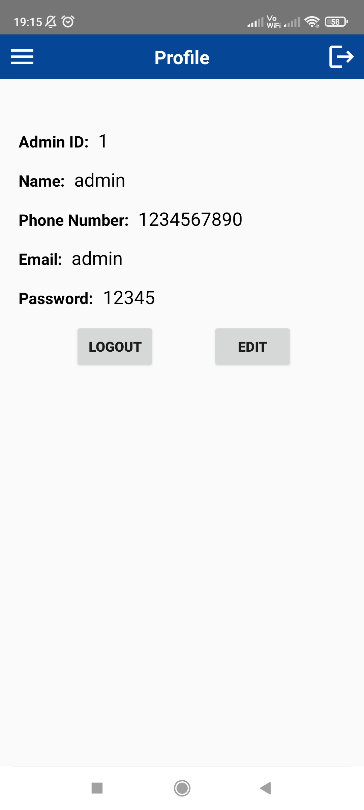  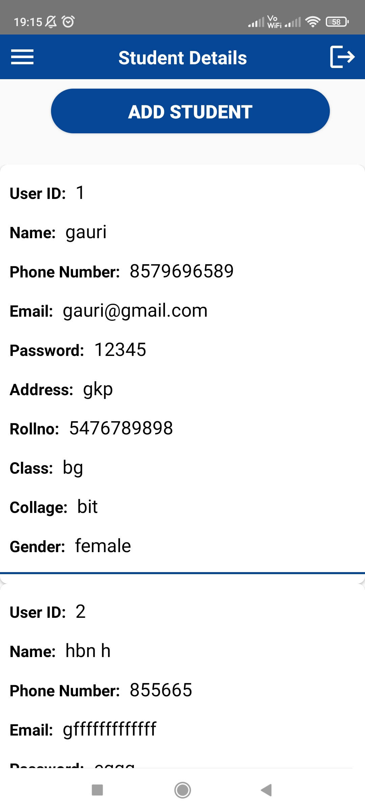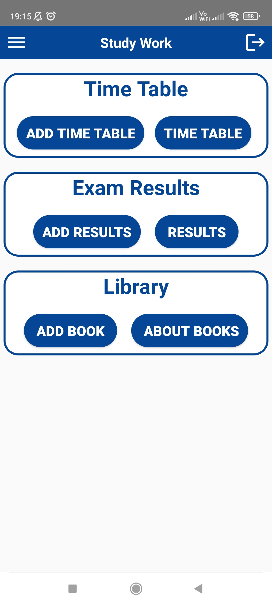  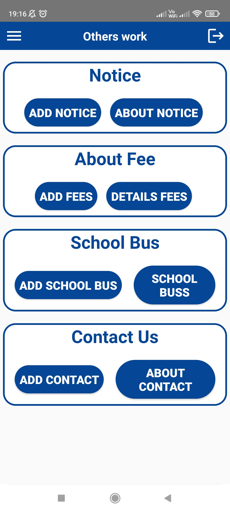

### Student Pages

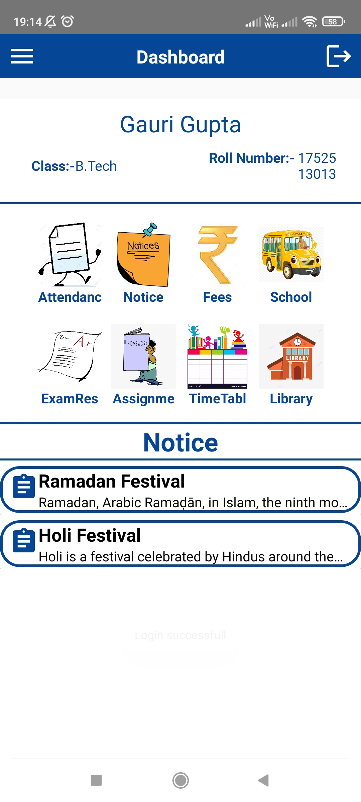  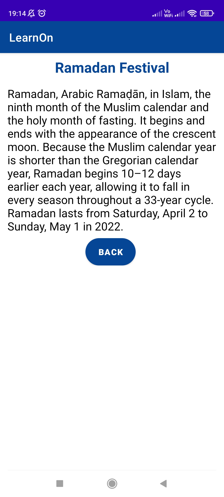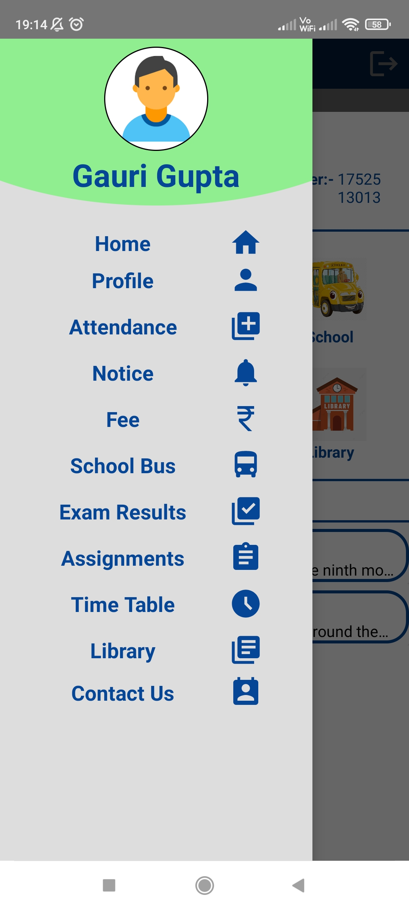  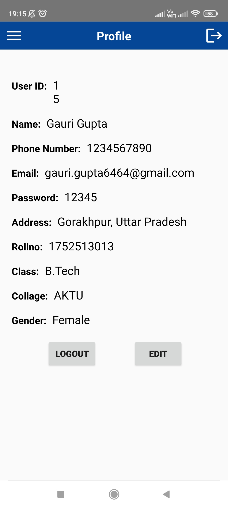
